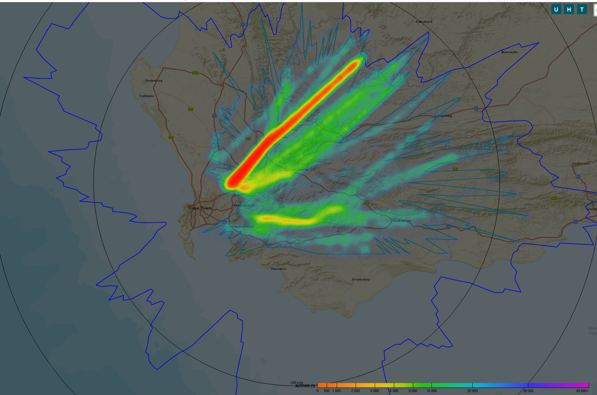
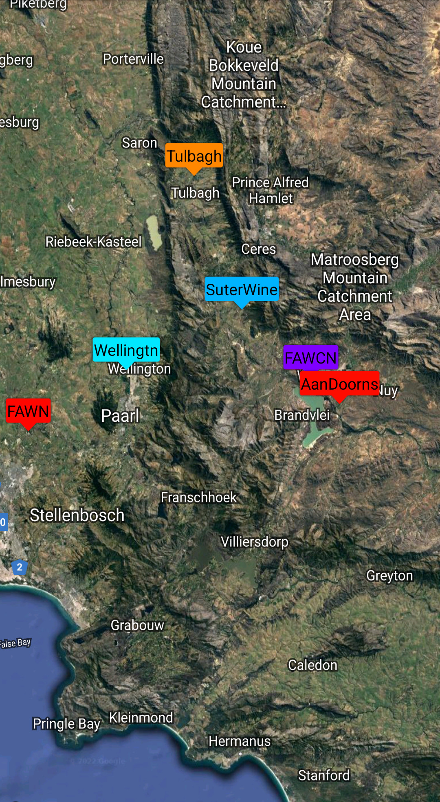

---
# Feel free to add content and custom Front Matter to this file.
# To modify the layout, see https://jekyllrb.com/docs/themes/#overriding-theme-defaults

layout: page
description: Introduction to Aviaturing

---

Aviaturing provides expertise and products within the intersection of:

1. Aviation,
1. Software, and,
1. Radio Frequency Digital Signal Processing.
 
 

Heatmap of high altitude aircraft transponder activity.

 
 
 

A sample of the Open Glider Network ISM receivers that Aviaturing operates, with a coverage area
 of tens of thousands of square kilometers in the Western Cape, South Africa and beyond.

 
 

 
#### Contact: 

For more information, please email us.

