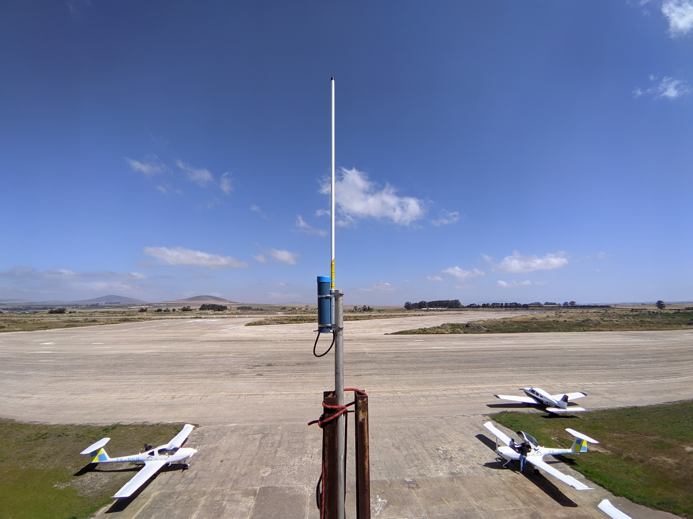
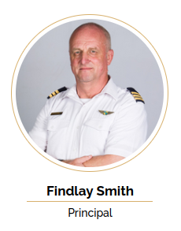

Aviaturing installs an Electronic Conspicuity receiver at the Cape Winelands airport (FAWN) 
for the [Cape Town Flight Training Centre](https://ctftc.co.za/).  

 
> "The Aviaturing OGN Receiver has enabled us to track our planes (and students!) in real time via our aircrafts' 
Electronic Conspicuity devices.  This situational awareness has been a huge boon to our safety and  peace of mind."

[Cape Town Flight Training Centre](https://ctftc.co.za/)
